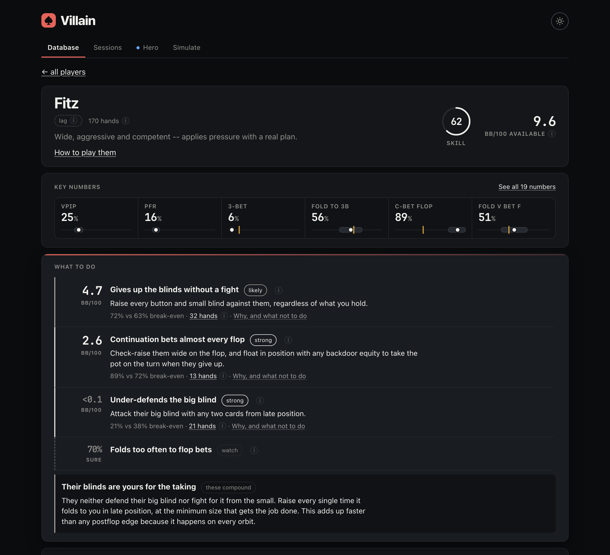
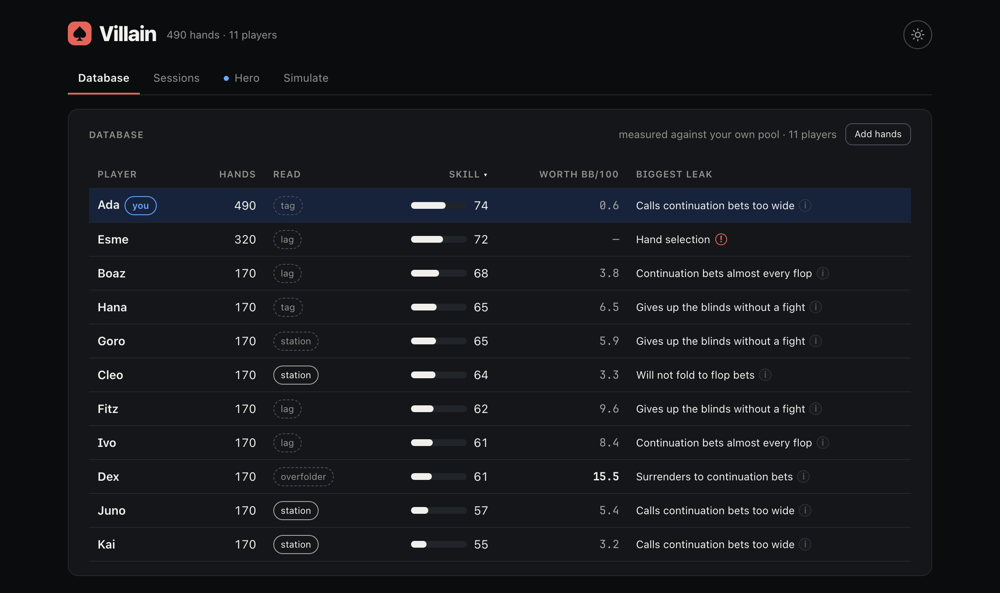
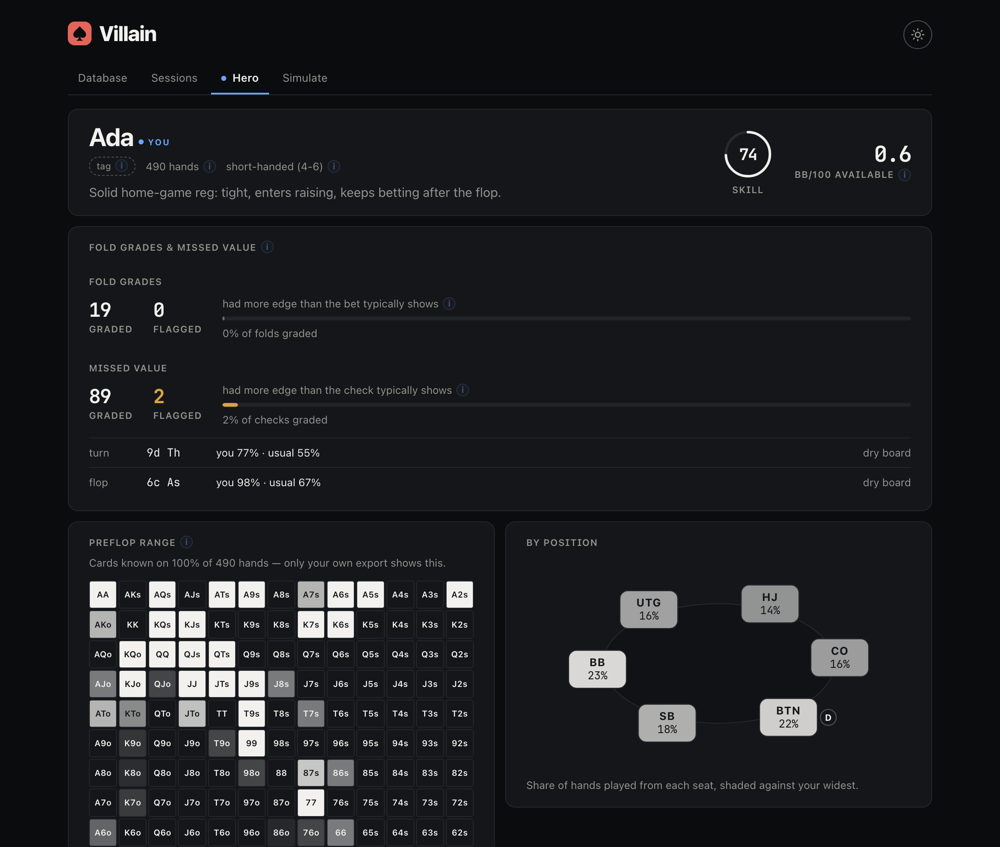
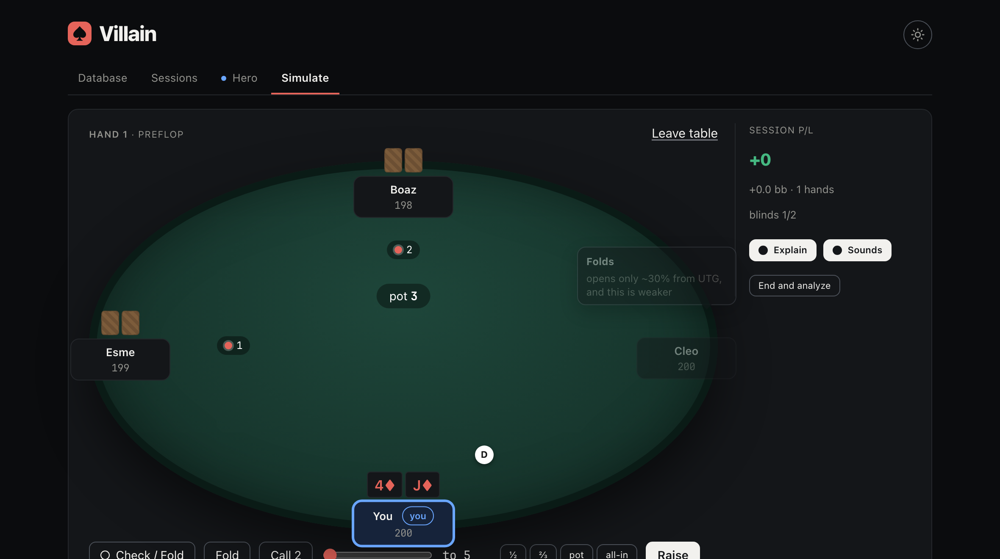

<div align="center">

# Villain

**Reads your poker hand histories and tells you how to beat the people you play against.**

[](https://github.com/aroraarnav/villain/actions/workflows/tests.yml)
[](https://villain.aroraarnav.com/)
[](https://www.python.org/downloads/)
[](LICENSE)

### [→ Open the app](https://villain.aroraarnav.com/)

</div>

Drop in an export from a session and, for every opponent, Villain works out what
kind of player they are, the specific mistakes worth attacking and what each one
is worth in big blinds per hundred hands, and a skill rating — then remembers
them the next time they sit down.

It is built for **home games and small samples**. A session is only a couple of
hundred hands, so the whole design is about telling a real read apart from a
lucky run of three folds. Every number on screen came out of the stored hands;
nothing is estimated to fill a gap, and anything the evidence does not support
says so.



---

## Use it

**[villain.aroraarnav.com](https://villain.aroraarnav.com/)** is the
tool. It is the whole application — the same Python, compiled to WebAssembly and
running in the tab. Open it and drop a PokerNow export on the Database tab.
Hands are parsed on your machine; the histories are never uploaded to be read.

It asks which way in you want:

- **Sign in with an emailed link** and the database follows you — the same
  SQLite file, gzipped and stored privately under your account, on the next
  laptop as well as this one. A first sign-in starts empty; import your own
  hands.
- **Take the demo** — a sample roster with all ten archetypes already profiled,
  which you can read but not add to.

Nobody's reads are pooled. Your file is yours, and row-level security means
another account cannot open it. That is the part of
[discussion #14](https://github.com/aroraarnav/villain/discussions/14) that is
built: portability of *your* database, not a shared one.

## Run it locally

Same interface, no account, the database a file at `~/.villain/villain.db`.
Needs Python 3.11 or newer.

```bash
git clone https://github.com/aroraarnav/villain.git
cd villain

python3 -m venv .venv
source .venv/bin/activate          # Windows: .venv\Scripts\activate
pip install -e .

pytest                             # 385 tests
villain test                       # then open http://127.0.0.1:8766
```

`villain test` runs the web app on a loopback socket against your own database.
It is the same interface the hosted page serves, with the transport swapped —
useful for working on the tool, and for anyone who would rather not sign in
anywhere. There is no separate desktop build to keep in step.

`villain scout tests/data/pokernow_sample.json --min-hands 1` is the twenty-hand
parser fixture, if you want CLI output before an export of your own.

<details>
<summary><b>Building and deploying the hosted page yourself</b></summary>

```bash
pip install -e . build
python web/build.py               # assembles web/dist/
python web/serve.py               # opens http://127.0.0.1:8000
```

`web/build.py` is orchestration, not logic: it builds the wheel with the
ordinary packaging tools, seeds the demo database through the *real* import
path so the demo cannot diverge from the tool, warms the hero cache, and copies
in the boot page and typefaces.

Deployment is automatic — `.github/workflows/pages.yml` builds `web/dist/` and
publishes it on every push to `main`. Sign-in needs a Supabase project (free, no
card) and is described in [web/SYNC_SETUP.md](web/SYNC_SETUP.md). Unconfigured,
the page is demo-only and still fully usable.

Signing in changes where the database lives, not what it does: hands are still
parsed in the browser, and what is stored is the finished SQLite file, gzipped,
readable only by the account that wrote it.

</details>

---

## The interface

Four tabs. The hosted page and `villain test` serve the same ones.

### Database

Everyone you have recorded, ranked by skill, with the bb/100 you can attack them
for alongside. Drop any number of exports on it at once: duplicates are skipped
by hand id, and the identity questions are asked once for the whole batch rather
than once per file — so you cannot answer "same player" for one file and
"different" for the next.



Click a row for the profile. It is one screen, in one order: who they are and
what they are worth, the six numbers every tracker prints, then **what to do** —
the priced leaks, ranked by the money in them, with the evidence behind each one
click away. A mid-session read that requires scrolling is one you will not use.

### Sessions

One sitting at a time, derived from the gaps between hands rather than stored.
Who played, what they looked like that night, and what they did more or less of
than usual. Compared *within* a table size, because "+8pp VPIP" otherwise just
measures which table somebody sat at. A player with too little history outside
the sitting is told so rather than given a trend.

A sitting read and the pooled read on the same person can disagree — a night can
look nothing like a season — so the pill says which one you are looking at.

### Hero

You, measured against yourself. Your own cards are visible on every hand while
everyone else's show only at a showdown, so your history can grade what theirs
cannot: how often your folds were right, the value you left on the table, and
how your range, sizing and timing shift from spot to spot.



The opponent machinery — your priced leaks, your key numbers, your skill
breakdown — is still there, at the foot of the page under *how you look as a
villain*. It is what any opponent with your hand histories could work out, so it
sits below the analysis only you can run.

### Simulate

Sit down and play real hands against players from your own database. Each
villain acts from its own measured profile — a station calls you down, a nit
folds, a maniac keeps barrelling — so it plays like practice against the exact
people you face, and with **Explain** armed it tells you *why* each of them did
what they did. End the session for a read on how you came out, hand by hand and
against each opponent.



### Things it does so you do not have to think about them

Every shorthand carries an **ⓘ** with what the statistic counts and what *high*
and *low* each mean — both are usually exploitable and call for opposite play —
and a test fails if a statistic reaches the screen without one. Every frequency
is drawn with its credible interval, the field, and the break-even it is
measured against, so a number is never shown without the uncertainty around it.
Long imports block the window, because the server handles one request at a time
and clicking through a half-written database is how you get one. **Reset** makes
you type `delete everything`; exports are untouched, so statistics can be
rebuilt — the merge and rename decisions cannot.

### Saving a session

**Add to database** is the only moment the tool asks you anything. Identity is
where a profiler destroys its own data — merge two people and both profiles
become fiction, split one and half of what you know is gone — so it asks about
every call it is unsure of rather than guessing.

- **One account id, a new display name.** The PokerNow case, almost always a
  rename, so it defaults to *same player*. Answer no and they stay apart, keyed
  `<account>#<name>` so neither loses its existing hands.
- **Two account ids that look like one person** — `villain`, `villain2` —
  default to *different people*: the merge is the more expensive mistake on the
  weaker evidence.

Accounts dealt into the same hand are never offered as a merge, whatever their
names look like.

---

## The command line

The app is the product; the CLI is the same engine without the browser. Every
command takes `--db PATH` before the subcommand; the default is
`~/.villain/villain.db`.

| command | what it does |
| --- | --- |
| `villain scout FILE...` | read a file, save nothing (`--min-hands N`, default 20; `-v`) |
| `villain import FILE...` | read it and store it (`--quiet`) |
| `villain players` | who is in the database (`--min-hands N`) |
| `villain profile NAME` | the full read (`-v` for deviations and timing, `--json`, `--narrate`) |
| `villain profile NAME --by-table` | split by table size instead of pooling (`--regime hu\|3max\|6max\|full`) |
| `villain link --suggest` | find accounts that may be one person |
| `villain link KEEP ABSORB` | merge player `ABSORB` into player `KEEP` |
| `villain unlink ID SITE ACCT` | split one alias back onto its own player |
| `villain note NAME "tilts after a big pot"` | attach a note to a player |
| `villain hero` | what only your own hand history can show |
| `villain table NAMES...` | lineup briefing for who is sitting here |
| `villain fit` | learn priors, clusters and hand strength from your own database (`--min-players N`, default 8) |
| `villain rebuild` | recompute every profile from stored hands |
| `villain export FILE` / `import-db FILE` | move a database between machines |
| `villain test` | run the web app locally (`--port N`, default 8766; `--no-browser`) |

**PokerNow** is currently the only supported format: open the game log and use
the export button, which gives a `poker-now-hands-game-*.json` file that both
the website and the CLI take as-is. Other sites need a parser in
`villain/parsers/`; the registry sniffs formats by file content, so adding one
touches nothing downstream.

### Optional: model-suggested exploits

Everything else is deterministic -- the same hands always give the same read,
and no figure on screen came from anywhere but the arithmetic. One optional
extra sends the finished profile to a language model and asks for exploits the
rule engine missed: the rules only fire on patterns somebody thought to encode,
while a model reading the same numbers can combine them and reach spots no
single rule covers. It is the **generate additional exploits** button on a
player's page, and it returns bullets, not prose.

Off unless configured. Settings come from the environment, falling back to
**`~/.villain/env`** -- a plain `NAME=value` file, deliberately outside the
project directory, because a key that never sits under the working tree cannot
be committed by an absent-minded `git add -A`.

| variable | meaning |
| --- | --- |
| `VILLAIN_LLM_MODELS` | comma-separated fallback chain, best first |
| `VILLAIN_LLM_MODEL` | a single model, if you do not want a chain |
| `VILLAIN_LLM_URL` | any OpenAI-compatible `/chat/completions` endpoint (default Ollama on localhost) |
| `VILLAIN_LLM_KEY` | bearer token, if the endpoint needs one |

Local, with nothing leaving the machine:

```bash
brew install ollama && ollama serve
ollama pull llama3.2
VILLAIN_LLM_MODEL=llama3.2 villain profile "seat 4" --narrate
```

Or a hosted free tier, in `~/.villain/env`:

```
VILLAIN_LLM_URL=https://generativelanguage.googleapis.com/v1beta/openai/chat/completions
VILLAIN_LLM_MODELS=gemini-flash-lite-latest,gemini-3.5-flash-lite,gemini-flash-latest
VILLAIN_LLM_KEY=your-key-here
```

**Why a chain, lightest first.** Free tiers meter each model separately, so
when one is out of quota another usually answers at once -- a second name
recovers faster than any retry, because a spent quota does not clear inside a
backoff. Small models are enough for short bullets built from a fact sheet, and
they carry the roomier quotas, which is what decides whether the button works
when you press it. Transient failures (429, 5xx, timeouts) retry with backoff
and honor `Retry-After`; 401 and 404 raise at once, since retrying those only
delays the same answer. Use floating aliases like `gemini-flash-lite-latest`:
pinned Gemini versions retire and start returning 404 to a tool that worked
last month.

**Two guards on what it can say.** It may not state a figure the profile did
not produce -- the output is checked, and an invented number is sent back with
the offending figure named, up to two more attempts, before the response is
refused. And every
statistic reaches it spelled out ("having bet the flop, how often they fire
again on the turn: 41%") rather than as an internal key, because a correctly
quoted number used to mean the wrong thing is a mistake no guard on invented
figures can catch. Any statistic the glossary cannot describe unambiguously is
withheld rather than handed over.

Suggestions are labeled as suggestions. They are not measured reads, and the
evidence view exists to check them against the hands.

## Reading the output

```
------------------------------------------------------------------------------
seat 4  --  heads-up, 183 hands (usable)
------------------------------------------------------------------------------
READ: TAG  (confidence 51%)
  Solid and hard to exploit; frequencies sit close to the field.

  No large leak to attack. Play position, take the small edges, and look for
  the money at another seat.
  (also plausibly: trapper 20%, station 15%)

EXPLOITS  (1 found)
  [tentative] Folds too often to river bets  ~2.3 bb/100
      51% vs 40% breakeven  (field 45%, n=16)
      Bluff every river you reach with a busted hand, and size up -- they are
      folding to the decision rather than to the price.

AGAINST YOU  (1 found)
  Against their own game, not against the field.

    re-raises your opens          19%   (3% otherwise)   32 seen, 99% sure

SKILL: strong (69/100)   confidence 54%
    showdown judgment         ##############....  77.3
    hand selection             ###############...  81.5
    bet sizing                 ###############...  85.3
    preflop aggression         ##################  97.6  raises 73% of hands played
    resistance to exploitation ############......  62.1  ~2.3 bb/100 available
  observed -1.0 bb/100, shrunk and all-in adjusted -0.2 bb/100
```

Note what it does *not* claim: 183 hands buy a bucket at 51% confidence and one
leak still labeled tentative, which is what a session this size contains.

Each exploit answers four questions — what they are doing (as behavior, not as
a statistic), why it is exploitable (the breakeven arithmetic), what to do, and
the counter-mistake, which matters most because nearly every way of losing
money to a correct read is an over-adjustment. Leaks that compound are called
out together: folding flops too often *and* never check-raising removes both
the reason to fear betting and the cost of being wrong.

Leaks are sorted by **bb/100**, what one is worth per 100 hands if you attack
it every time, and labeled `tentative`, `likely` or `strong` by how much comes
from this player's hands rather than from the prior. No leaks usually means not
enough hands yet, and the tool says so rather than inventing something.

### Checking a read

Every exploit and every rating component carries a **see the hands** button —
the board as cards, what they did, what it cost — and any of them replays street
by street. It opens on the hands where the thing actually happened, with the
rest a click away, and says in a line what the rate means: *4 of 2,945 — 0%,
almost never. Normal, good players rarely limp.* A statistic with thousands of
instances gets no button, because a list of every hand somebody played is a
denominator rather than evidence. Nothing
extra is stored: contributing hands are found by replaying each hand through
the same extraction the statistics use, so the evidence cannot drift from the
number, being the same code. It is also the fastest way to catch the tool being
wrong; building it surfaced VPIP counting once per preflop *decision* instead
of once per hand.

## How it works

**The whole problem is small samples.** A home game session is about 200 hands
— 20 to 40 observations of any postflop statistic. A tracker will tell you the
villain folds to 100% of turn bets because he folded the only three he faced,
and betting every turn on that basis is how you donate to a normal player. The
hard part is not computing statistics but knowing which of them mean anything
yet, and everything below follows from that: this is built for a couple of
hundred hands, not a couple of hundred thousand.

**Everything is shrunk toward a population prior and carries its own
uncertainty.** A frequency is a Beta posterior, not a fraction. A prior is a
mean `m` and a strength `s`; `h` hits in `n` chances give
`Beta(m·s + h, (1−m)·s + n − h)`, so the estimate is `(m·s + h) / (s + n)` and
the interval comes out of the same posterior. Three observations barely move
it, three hundred make the prior irrelevant, and nothing has to decide when a
sample became "enough" — the arithmetic does that continuously.

**The prior is fitted from your own pool, not assumed.** With eight or more
players who have five or more chances at a statistic, a Beta-Binomial
method-of-moments fit replaces the built-in online numbers. The mean is the
pool average; the strength comes from the *spread between players*, taking the
total variance and subtracting the binomial sampling noise `m(1−m)/n̄`. What is
left is genuine player-to-player variation, and `s = m(1−m)/between − 1`. If
everyone in your game folds to c-bets at about the same rate, three
observations of a new player should barely move them; if the spread is wide,
the same three carry real information. The fitted population then feeds the
archetype label and the exploit thresholds as well as the shrinkage — measuring
a home game against a generic online field otherwise makes every deviation
wrong by the gap between the two.

**Table size is part of a player's identity.** 55% VPIP is a nit heads-up, a
normal three-handed player and a maniac at a full ring, so statistics are
bucketed by table size as they are *collected*. Reporting them that way is
unreadable, so each player still gets **one** profile, pooled in log-odds: each
table's counts become a deviation from that table's own population, translated
onto the scale of the table they play most, then discounted, because related
games are not the same game. `--by-table` shows the split.

**Reads are earned by data.** Some population frequencies already sit near an
exploit's breakeven point, so a rule firing on the estimate alone would flag
players nobody has observed. Every leak reports how far the evidence moved it
from the prior, and reads are graded rather than dropped.

### Buckets

Ten archetypes — `nit`, `station`, `overfolder`, `maniac`, `lag`, `tag`,
`tight passive`, `loose passive`, `limper`, `trapper` — each a *plan* rather
than a personality: "station" is the bucket whose plan is "value bet thin and
stop bluffing".

Prototypes are deviations from the population **in log-odds**, which is the
difference between working and not: frequencies are bounded, so points on a 70%
base are not the same change as points on 24%. In linear space the same "nit"
prototype produced a six-handed player who plays 2% of hands; in log-odds it
lands at 44% heads-up and 9.5% full ring, which is what "nit" meant in both.

Matching is a likelihood, not a distance: raw counts are scored against each
archetype's implied frequencies with an overdispersed Beta-Binomial. Shrinking
first and then measuring distance counts the uncertainty twice, and thin
samples collapse onto the prototype in the middle. All ten are scored over
the *same* features — one scored only on the features it mentions wins by
mentioning fewer — and the result is a posterior, because players sit between
buckets.

### Matching is a likelihood, not a distance

Each archetype implies a frequency per feature: the population mean shifted by
that archetype's deviation, in log-odds, scaled by the feature's spread. Raw
counts are then scored against each implied frequency with an overdispersed
Beta-Binomial, and the archetype posterior is the product across features,
weighted by how much each feature identifies a plan and discounted because
those features are correlated — VPIP and PFR are not independent measurements.

Shrinking first and *then* measuring distance to a prototype would count the
uncertainty twice and collapse every thin sample onto whichever prototype sits
in the middle. That failure is worth naming because it recurs: a prototype
close to the population center wins every ambiguous player by default, so each
archetype needs a real identity, not just a name. The bucket a player is
"between" is reported rather than hidden.

### Leaks are priced from pot odds, not from the field

A leak fires on an **absolute** threshold, because what makes a tendency
exploitable is arithmetic, not fashion:

* a bluff of size `f` breaks even at a fold frequency of `f / (1 + f)` — 33% at
  half pot, 40% at two thirds, 50% at pot;
* below a third folds, even the cheapest bluff worth making loses money, so the
  exploit inverts from pressure to thin value;
* a steal risking `r` to win `p` breaks even at `r / (r + p)`;
* facing a bet of size `s` a call needs `s / (1 + 2s)` equity, so a range that
  bets past `v / (1 − s/(1+2s))` — about 1.40× the field at two-thirds pot — is
  betting more than its value hands support, and calling down profits.

That last one is the mirror of the first, and it exists because pricing only
the passive errors made an over-aggressive player look unexploitable rather
than merely unmeasured.

Folding 55% to a two-thirds pot bet is exploitable whether or not the rest of
the pool folds 55% too; population comparisons only *identify* a player, and
appear as context. Severity is the estimated bb/100 from taking the exploit,
from that player's own pot sizes and how often the spot comes up, scaled by
`CAPTURE` in `exploits.py` to the share of spots you can realistically convert
— you cannot bluff a river you reached with the nuts. That constant is an
assumption stated in the source rather than buried, so severities are best read
as a ranking of what to attack first.

### Against you

Every frequency above is measured against a population: how they play
everybody. **Against you** is the same counter sliced to the decisions where
you were the one they were facing, and it is the number that says they have a
read on you rather than a tendency. Folding 70% to your river bets is not
interesting because 70% is high. It is interesting because they fold 45% to
everybody else's.

So the prior is not the field, which has never played you — it is the player.
Population, then the player, then the player against you, all the same
arithmetic one level deeper. The baseline **subtracts the slice out of the
pooled counter first**: the slice sits inside that total, so reading it against
the total compares a number with something that contains it, and the difference
vanishes exactly when the sample grows enough to be worth reading.

Table size is the confound this would otherwise invent. Somebody you have only
played heads-up folds far more there than at their six-handed table, and
pooling raw counts reports that as thirty points of adjustment when they are
merely playing a shorter table. Each table size's slice is therefore measured
against *that* table's baseline, and only the deviation is carried over,
re-expressed on the primary table's scale and discounted.

Two refusals worth knowing about. If every decision they made was against you —
a heads-up database — the baseline is a number subtracted from itself, and
nothing is reported rather than the population deviation twice. And a
difference has to be big enough to change a decision, not merely certain,
because enough hands make any difference certain. Most players, most of the
time, have no adjustment at all; that is the normal result.

Scoped to you and nobody else. Every pair would be quadratic in players and
starved in every cell, while you are the one opponent with enough shared hands
to say anything. Which seat is yours comes from the export itself — PokerNow
names the exporter — falling back to whose cards are visible without having
been shown, since an export shows you your own hand every time and everybody
else's only at a showdown.

### Skill

Rating a player by results is rating their luck, so results carry the smallest
weight, and only after all-in pots are rescored by equity so a cooler and a
punt stop looking alike. The rest is **fundamentals** — distance from competent
play for that table size, penalized asymmetrically where the errors are — and
**resistance to exploitation**, the bb/100 the exploit layer can find, weighted
by sample size, because "no leaks found" and "no leaks yet findable" are the
same number and only one is a compliment.

### Remembering people

Hands are the source of truth and statistics are a disposable cache:
definitions change, and `villain rebuild` recomputes every profile from stored
hands rather than leaving old players wrong until they sit down again.

The same human is one screen name at one table and a near-miss of it at the next, so
accounts are aliases pointing at an internal player. Candidate merges come from
name similarity (case, punctuation and trailing digits stripped) and a Bayes
factor over their statistics — one player against two — which stops two tight
players being merged for nothing more than both being tight. Nothing merges
automatically, and accounts dealt into the same hand can never be linked.

### Learning from your own pool

`villain fit` runs three models and says which ones your data can support:
**priors** re-estimated from your own players by a Beta-Binomial moments fit,
so a home game stops being measured against an online population and the spread
between your players sets how much a new sample is trusted; **clusters**, a
Gaussian mixture over profiles with component count by BIC, needing 25+
profiles; and **hand strength**, gradient boosting from a line (street, action,
sizing, position, board texture, time taken) to the strength behind it, trained
on revealed cards, needing 300+ revealed decisions. Each refuses rather than
returning something authoritative-looking and wrong.

## Known limitations

* **Showdown data is biased.** Villains' cards are revealed only at showdown,
  and hands reaching showdown skew toward calling lines and away from the
  bluffs that took the pot down uncontested. The strength model therefore
  *underestimates* how weak betting ranges are. The exporting player's own
  cards are visible on every hand and those rows are marked unbiased, but the
  bias is reduced, not removed.
* **Severity constants are assumptions.** The breakeven thresholds are derived;
  the capture fractions are judgment calls. So is `ADJUSTMENT_PRIOR` in
  `dynamics.py`, which decides how much evidence it takes to believe somebody
  is playing you differently: fitting it would need pairwise samples across
  many players, and a home game has one pair worth counting.
* **Adjustments are never priced.** A leak is worth a stated bb/100; an
  against-you shift is not, because what it is worth depends on how you were
  playing when they made it, and that is not in the hand history.
* **Side pots are approximate.** Each player's equity is capped at the pot they
  were actually eligible for, so a short all-in is no longer credited with money
  it could never have won, but the split between layered pots is not modeled
  and those hands carry a `side_pot` flag.
* **Built-in priors are pool-agnostic.** They describe a generic online
  population until your own pool can replace them, which happens automatically
  on import once eight players clear the bar. The fitted population then feeds
  the archetype label and the exploit thresholds too, not just the shrinkage.
* **PokerNow is the only parser so far.** The format registry in
  `villain/parsers/` takes new sites without touching anything downstream.

## Layout

| module | what it owns |
| --- | --- |
| `model.py`, `parsers/` | canonical hands; `pokernow.py` decodes the opcode log |
| `cards.py`, `equity.py` | vectorised 7-card evaluator, all-in equity |
| `stats.py`, `features.py` | additive sufficient statistics per hand |
| `priors.py`, `profile.py` | shrinkage, per-regime and cross-regime priors |
| `archetypes.py`, `exploits.py`, `skill.py` | buckets, priced leaks, rating |
| `dynamics.py` | how a player plays you differently from everybody else |
| `playbook.py`, `narrate.py` | written advice, optional LLM summary |
| `evidence.py`, `replay.py` | the hands behind a number |
| `cluster.py`, `reads.py` | models learned from your own database |
| `db.py`, `identity.py` | persistence, aliases, merge safety |
| `analyze.py`, `glossary.py`, `report.py` | the payload the CLI and UI both render |
| `cli.py`, `webapp/` | commands; the web app, served locally or in the browser |

## Contributing

Bug reports, new site parsers, and fixes are welcome. The one rule worth knowing
up front: **no figure reaches the screen that the arithmetic did not produce**,
and a test fails if a statistic appears without a glossary entry. See
[CONTRIBUTING.md](CONTRIBUTING.md) for the dev setup, how the test suite is laid
out, and how to add a parser for a new site.

## License

[MIT](LICENSE).
