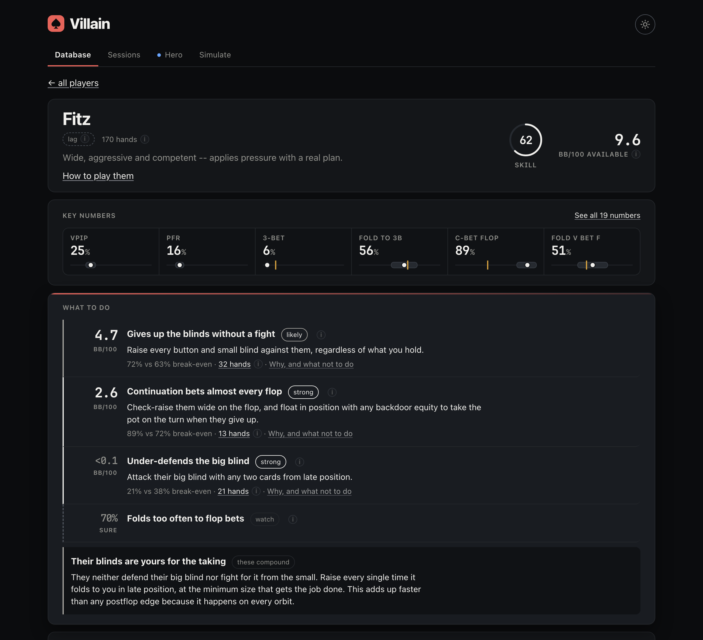
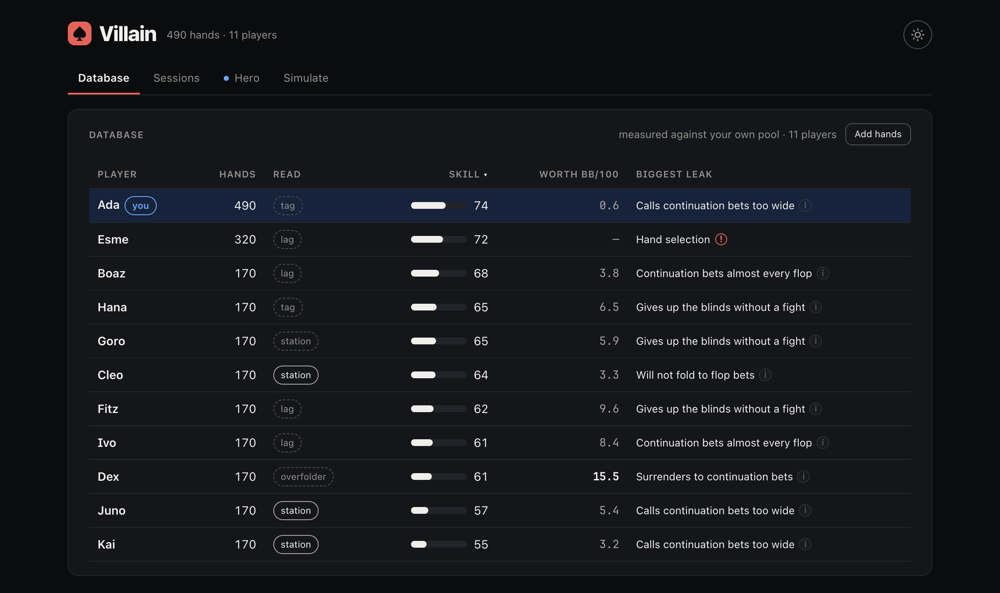
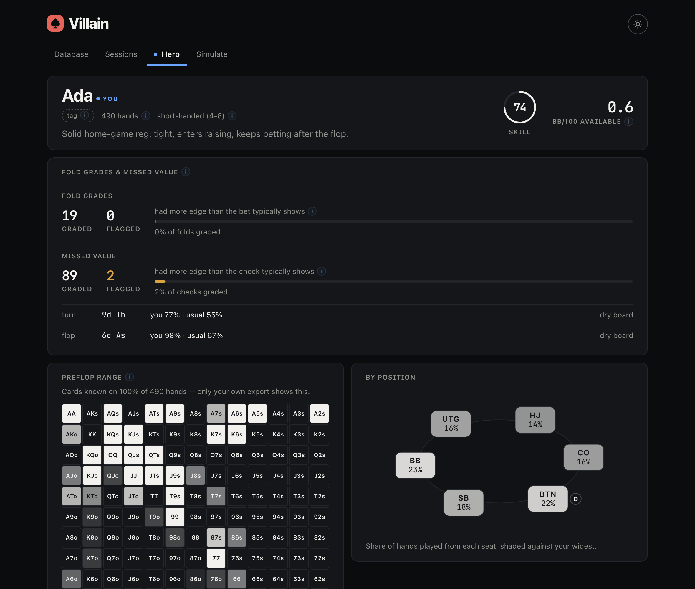
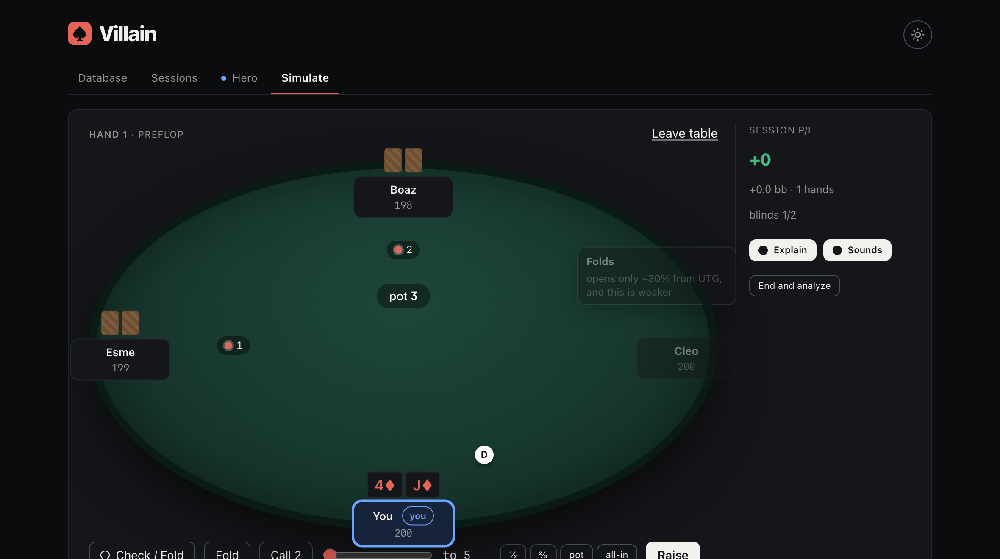

<div align="center">

# Villain

**Reads your poker hand histories and tells you how to beat the people you play against.**

[](https://github.com/aroraarnav/villain/actions/workflows/tests.yml)
[](https://villain.aroraarnav.com/)
[](https://www.python.org/downloads/)
[](LICENSE)

### [→ Open the app](https://villain.aroraarnav.com/)

</div>

Drop in a session export and Villain profiles every opponent: what kind of
player they are, which mistakes are worth attacking and how much each is worth,
and a skill rating. It remembers them for the next time they sit down.

It is built for **home games and small samples**. A session is a couple of
hundred hands, so the hard part is telling a real tendency from a lucky run.
Every number on screen comes from the stored hands, and when the evidence is
too thin, the app says so instead of guessing.



## Use it

Open **[villain.aroraarnav.com](https://villain.aroraarnav.com/)** and drop a
PokerNow export on the Database tab. The whole app runs in your browser; your
hand histories are parsed on your machine, not uploaded.

- **Sign in with an emailed link** to keep your database across devices. It is
  stored privately under your account, and no other account can read it.
- **Or try the demo**, a sample roster with every archetype already profiled.

To get an export, open the PokerNow game log and click export. You get a
`poker-now-hands-game-*.json` file. PokerNow is the only supported site for now.

## Run it locally

Same app, no account. The database is a file at `~/.villain/villain.db`.
Needs Python 3.11+.

```bash
git clone https://github.com/aroraarnav/villain.git
cd villain
python3 -m venv .venv && source .venv/bin/activate
pip install -e ".[dev]"

villain test        # opens http://127.0.0.1:8766
```

To build the hosted page yourself, run `python web/build.py` then
`python web/serve.py`. Every push to `main` deploys automatically. Sign-in needs
a free Supabase project; see [web/SYNC_SETUP.md](web/SYNC_SETUP.md).

## The app

**Database.** Everyone you have played, ranked by skill, with their biggest leak
and what it is worth. Click a player for their profile: who they are, their key
numbers, and what to do against them, ranked by how much money is in each leak.
Every claim has a **see the hands** button showing the hands behind it.



**Sessions.** One sitting at a time: who played, and what each person did
differently that night compared with their usual game.

**Hero.** You, graded against your own cards: how often your folds were right,
the value you missed, and how your ranges and sizing shift by spot.



**Simulate.** Play practice hands against bots built from the real players in
your database. Each one plays like its profile, and **Explain** tells you why it
did what it did.



**Saving a session** is the only time the app asks you questions. When an
account changes its name, or two accounts look like the same person, it asks
before merging. A wrong merge corrupts both profiles, so it never guesses.

## How it works

- **Small samples are the whole problem.** Three folds in three tries is not
  "folds 100%". Every stat is pulled toward what a typical player does and shown
  with its uncertainty, and more hands move it further from that default.
- **The typical player comes from your own game.** Once eight or more players
  have enough hands, Villain measures your pool and uses it in place of generic
  online numbers.
- **Table size matters.** 55% of hands played is tight heads-up and wild at a
  full table, so each table size is measured separately and then combined.
- **Leaks are priced with pot odds.** A leak is a tendency that is exploitable,
  judged by breakeven math and not by comparison with the field. Its worth is
  in big blinds per 100 hands (bb/100).
- **Skill is mostly fundamentals, not results.** Winnings over a few hundred
  hands are mostly luck, so they count for little. Players with under 150 hands
  are shown as unknown instead of getting a rating.

The full explanation, with the math, is in
[docs/how-it-works.md](docs/how-it-works.md).

## Command line

Every command takes `--db PATH` before the subcommand.

| command | what it does |
| --- | --- |
| `villain import FILE...` | store hand histories |
| `villain players` | list players and their ids |
| `villain profile NAME` | a player's full read, as JSON (`--by-table` to split by table size) |
| `villain link --suggest` | find accounts that may be one person |
| `villain link KEEP ABSORB` / `villain unlink ID SITE ACCT` | merge or split players |
| `villain note NAME "text"` | attach a note to a player |
| `villain rebuild` | recompute every profile from stored hands |
| `villain export FILE` / `villain import-db FILE` | move a database between machines |
| `villain test` | run the app locally (`--port N`, `--no-browser`) |

## Contributing

Bug reports, fixes and new site parsers are welcome. The one rule: every number
on screen must come from the hands, and every stat needs a glossary entry.
[CONTRIBUTING.md](CONTRIBUTING.md) covers setup, tests and adding a parser.

## License

[MIT](LICENSE)
